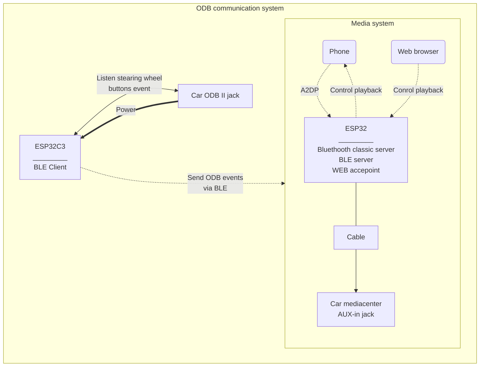

---
Proposed schema
---
Because it's barely impossible to recive music stream on ESP32 and send it to other bluethooth device at the same time I suggest use 2 ESP32 controllers:
 - One for streaming music, runnig WI-FI acces point and webserver, and also running Bluethooth Low Energy (BLE) Server (ESP Media)
 - Second one for communicating with ODB and sending/reciving info to the first one via BLE protocol (ESP ODB)

 - For now I disabled "Auto reconnect" feature so each time you sit in the car you need to bind your phone to the BT2Car bluethooth device. 
 - It's possible to store information of last n connected devices in flash memory, then via web it possible to initiate connection from ESP32.
 - It's also possible to have 2 bluethooth devices active (one on ESP32 ODB and one on ESP32 Media). When Phone1 is connected to ESP32 Media and streaming you can connect to the ESP ODB from Phone2. Then ESP ODB will drop the connection with Phone2 and send BLE message to ESP Media. After reciving this message ESP Media will drop connection with Phone1 and connect to Phone2.
